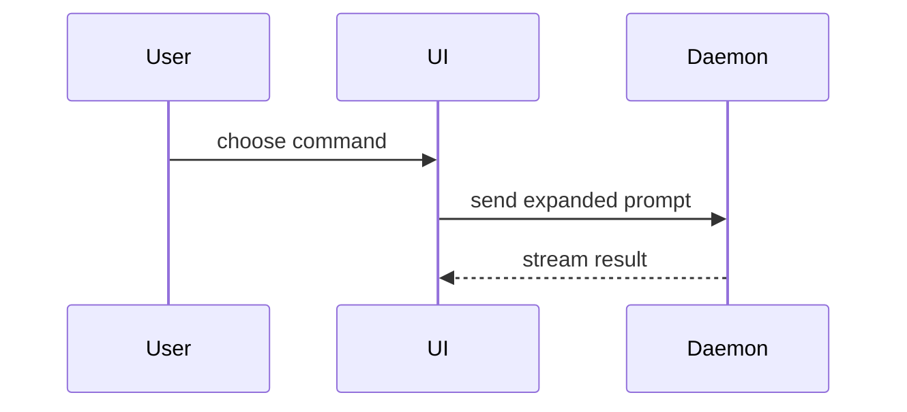

# Show Me

## Objective

Help the user understand the current topic of conversation visually. Skip the preamble and
keep prose brief. Pick the smallest view that makes the key point clear.

Use this Skill when a visual would make structure, flow, change, or tradeoffs easier to
understand. Do not add a visual when a short sentence or small list is clearer. Base factual
diagrams on inspected source material; do not invent files, calls, states, or relationships.

## Visual forms

- Show logic or an algorithm as pseudocode:

```text
on(save)
  if content is unchanged
    return cached result
  write new content
  return fresh result
```

- Show runtime control flow as a call tree:

```text
submitForm
  createSession
    persistPrompt
    launchAgent
  navigateToSession
```

- Show UI structure as a component tree, including state and module boundaries that matter:

```tsx
<SessionPage> (apps/example/src/routes/session.tsx)
  useSessionEvents()
  <SessionToolbar>
    <RunSkillButton> (packages/ui)
```

- Show file responsibility or a broad refactor as a shallow file tree:

```text
src/
├── commands/       # parses user actions
├── sessions/       # owns session state
└── transport/      # sends API requests
```

- Show component interaction, control flow, or data flow with Mermaid:



- Use `diff` when the point is what changes and the surrounding shape already exists. Match
  the diff shape to the topic.

For a component change:

```diff
 <SessionPage>
   useSessionEvents()
   <SessionToolbar>
+    <RunSkillButton />
   <SessionTimeline>
+    <SkillResultCard />
```

For a file-layout change:

```diff
 src/
 ├── commands/
+│   └── show-me.ts       # expands the slash command
 ├── sessions/
-└── transport.ts
+└── transport/
+    ├── client.ts
+    └── stream.ts
```

For a call-tree or call-stack change:

```diff
 submitForm
   createSession
     persistPrompt
+    expandSkillMention
     launchAgent
-  navigateToSession
+  navigateToSession
+    subscribeToEvents
```

For a state or control-flow change:

```diff
 on(save)
-  write content
+  if content is unchanged
+    return cached result
+  write new content
+  invalidate cache
```

- Show the whole block when most of it is new, when omitted context would hide ownership or
  order, or when the user needs a copyable target shape:

```ts
function expandSkill(command: string): string {
  const skillName = command.slice(1)
  return `use the ${skillName} skill`
}
```

- For a visual UI, layout, state comparison, or concept too dense for Mermaid, write one
  focused HTML file: a diagram, infographic, or short slide deck, whichever fits the point.
  Match the product's colors, type, spacing, and components; use real labels and data; support
  desktop and mobile. Save it in the current workspace or the user's requested output
  directory, then make it available through the host's normal preview or file-link mechanism.

## Guidance

Place each visual next to the short text it supports. Keep only the calls, files, props,
states, and boundaries needed to answer the current question or resolve the current discussion
point.

You may use one form or several; it is unlikely that you need all of them. Use judgment and
do not overwhelm the user.

## Acceptance checks

- The visual makes an important relationship materially easier to understand than prose.
- It answers the current question and contains only relevant structure.
- Any factual structure matches the inspected source; assumptions are labeled.
- HTML artifacts are focused, legible on desktop and mobile, and linked or previewed for the
  user.
- The answer remains concise and does not repeat the same information in several formats.
